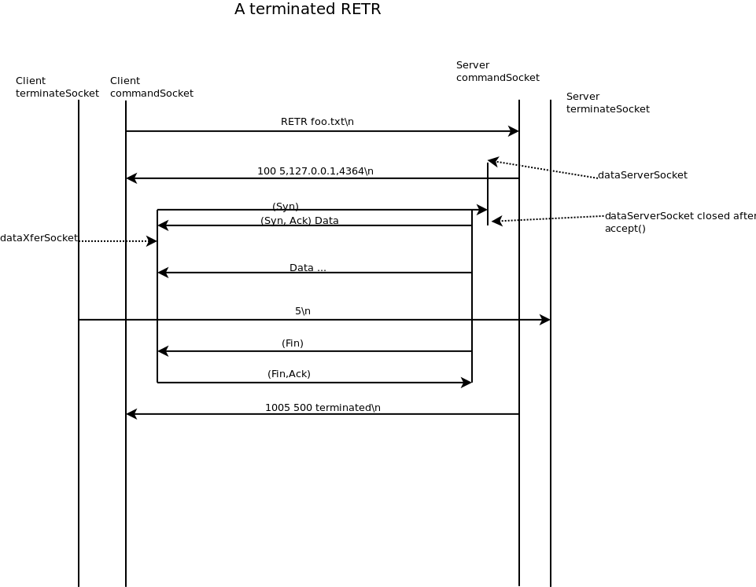

Introduction
============

The code here is a solution to CSCI 6780
[Programming Project 2](./docs/Programming-Project2.pdf). While this file
is human readable, it is best to view it as a processed markdown file on the
github site [here](https://github.com/evaitl/6780p2).

Design Notes
============

Project 1 pretty much followed the FTP protocol, with some minor
exceptions.  The requirements for project 2 break any possibility with
interoperation with FTP, so I'll feel free with modifying the protocol
as necessary.

There is no authentication, so a terminate command from any client can
terminate an in-progress transfer from any other client with an
outstanding matching commandID.

Skip the PASV command and assume all RETR, STOR are passive. Server
sends the addr/port/commandID in the 150 response.

We'll use a singleton with a synchronized "nextId()" to get the
command IDs. Command IDs will start at 1000. Any responses received by
a client that start with a number >= 1000 are assumed to be of the
format:

    commandID  responseCode  other text

The `1xx` command responses from the server for RETR, STOR commands
will be of the format:

    150 commandID  ADDR/PORT xxx

All responses to the RETR,STOR commands after the 150 response will be
in commandID response format.

Non get/put responses by the server will match the usual
protocol of:

    responseCode other text

FTP commands accepted by the server on the command socket are 
QUIT, MKD, RMD, CDUP, CWD, DELE, PWD, LIST, RETR, STOR.  We will add a
new command for the terminate socket called TERM:

    TERM <commandID> 

The server doesn't send a response on the terminate socket. Instead,
if the command is still active on the data connection, it will set a
terminate flag in the transfer thread object and let the transfer
thread object handle it from there.

There is a requirement that RETR,STOR requests for the same file
should be serialized.  To do that, we'll have to create a data
structure indexed by absolute file names to handle outstanding
commands.

The server is supposed to return command ids. As these are shared
among all clients, we'll have to create a singleton with a
synchronized nextID() method to increment and return the ID for a
RETR, STOR command.

We aren't allowed to use thread-safe data structures. I'm assuming
that means that we can't use `java.util.concurrent.Concurrent\*`, but
we can still use the `synchronized` keyword and the monitors built
into every Object.  It should be pretty easy to re-create whatever
data structure we need.

## Client design notes:

This project seems about threads, so I'm sure we aren't allowed to use
a reactive system with callbacks (poll/epoll/select). 

Because some commands can happen out of order, we need one thread on
the user interface (ClientMain), and one on the commandSocket
ClientCommandHandler.  For get/put (RETR/STOR), we may need to kick
off threads on temporary data sockets. The terminate socket is just
written to and we will assume that the buffer doesn't fill up enough
to block. So:

<pre>
   ClientMain implements Runnable   
      Keeps list of backgrounded get/put tasks.  List is
      searched/updated in synchronized methods.
      Owns user interface socket.
      commandResponse(int id, int code, String resp)      
      synchronized void transferComplete(int id);
      synchronized void transferStart(DataXfer bg);
      synchronized boolean currentXfer(int id);
      
   CommandHandler implements Runnable, Closeable
       Owns commandSocket
       synchronized println();

   interface  DataXfer implements Closeable, Runnable
        int  getId()

   class RetrData implements DataXfer

   class StorData implements DataXfer

   class ListData implements DataXfer

</pre>

The DataXfer classes call `ClientMain::transferComplete()` when their
transfers are done.

If a get/put/list is done without the '&', ClientMain sends the
command, creates the DataXfer class, and calls `DataXfer.run()`
directly. If a get/put is done with the '&', ClientMain uses
`Thread.start()` to kick off the DataXfer `run()` method.

On a terminate command, ClientMain checks the outstanding command
list. If found sends the teminate message. If this was a get, then
`java.io.file.Files.deleteIfExists()` the target file.  If commandId
not in outstanding command list, just tell the user.

## Server side notes:

There are several sockets to keep track of:

* serverSocket - one per process
* terminateSocket - one per process
* commandSocket - one per client. Returned by serverSocket.accept()
* dataServerSocket - Created, accept() once, and closed per RETR/STOR/LIST
* dataXferSocket - used once per RETR/STOR/LIST. Returned from
  dataServerSocket.accept.

We aren't supposed to do reactive programming here, so threads it
is. The classes:

    ServerMain
       Kicks off a TerminateHandler thread
       Owns serverSocket. Does serverSocket.accept(), kicks off
       new CommandHandlers.
       Keeps synchronized list of CommandHandlers.
       void terminateXfer(int id) -- forwards terminate command
          to all current CommandHandlers      

    TerminateHandler implements Runnable
       Creates/owns terminateSocket.
       Calls ServerMain.terminateXfer(id) on a terminate command. 

    CommandHandler implements Runnable
       Owns commandSocket.
       Keeps synchronized list of backgrounded Xfers for this client.
       synchronized void terminateXfer(int id);
       synchronized void xferComplete(int id);
       synchronized void addBg(DataXfer bg);

    interface DataXfer extends Runnable, Closeable
       int getId()

    ListXfer implements DataXfer

    RetrXfer implements DataXfer

    StorXfer implements DataXfer
    
The Xfer classes call CommandHandler::xferComplete() when done.

If a CommandSocket is closed, the CommandHandler should close() all
associated ServerDataXfer objects before returning from run().

Sequence Diagrams:
==================

A couple of sequence diagrams to clarify operation and protocol:

Questions:
==========

Disclaimer
==========

This project was done in its entirety by Eric Vaitl and Ankita
Joshi. We hereby state that we have not received unauthorized help of
any form.

